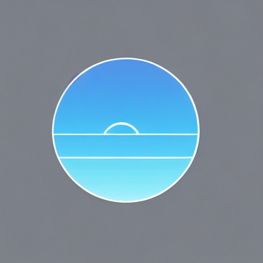
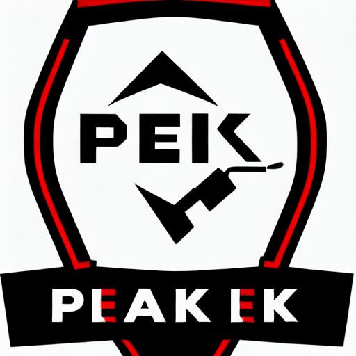
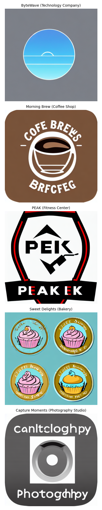

# Logo Generation with LoRA Fine-tuning

A Stable Diffusion 1.5 model fine-tuned with LoRA to generate professional business logos from text descriptions.

## Project Overview

This project implements a specialized logo generation model by fine-tuning Stable Diffusion 1.5 with LoRA (Low-Rank Adaptation). The model is trained on a dataset of modern logo designs to understand and generate business-appropriate visual elements, including:

- Business-specific styling
- Professional color schemes
- Appropriate composition and layout
- Relevant iconography
- Integrated typography

## Features

- **Data Processing Pipeline**: Processes logo images, removes backgrounds, standardizes sizes, and creates augmentations
- **LoRA Training Implementation**: Custom LoRA implementation focusing on attention modules
- **Inference Testing**: Tools to generate and compare logo outputs from different checkpoints
- **Business-specific Generation**: Tailored prompting system for different business types

## How It Works

The project consists of three main components:

1. **Data Preparation**: 
   - Loads logo datasets from Hugging Face
   - Processes images by removing backgrounds and standardizing sizes
   - Parses text descriptions to extract business types and styles
   - Creates augmentations with variations in brightness, rotation, and color
   - Generates standardized prompts for training

2. **LoRA Training**:
   - Implements custom LoRA targeting attention modules
   - Uses high rank (128) for detailed style learning
   - Applies gradient checkpointing for memory efficiency
   - Saves checkpoints during training
   - Fine-tunes specifically on self-attention layers

3. **Inference Testing**:
   - Loads the base model with LoRA weights
   - Generates multiple samples per prompt
   - Provides visualization tools for comparing results
   - Offers seed control for reproducibility

## Example Results

### ByteWave (Technology Company)

*Prompt: "A logo for a technology company named 'ByteWave', minimalist style, with blue gradient colors"*

### Morning Brew (Coffee Shop)

*Prompt: "A logo for a coffee shop named 'Morning Brew', modern style, with brown colors and coffee bean icon"*

### PEAK (Fitness Center)

*Prompt: "A logo for a fitness center named 'PEAK', bold style, with black and red colors, mountain silhouette"*

### Sweet Delights (Bakery)

*Prompt: "A logo for a bakery named 'Sweet Delights', vintage style, with pastel colors and cupcake icon"*

### Capture Moments (Photography Studio)

*Prompt: "A logo for a photography studio named 'Capture Moments', elegant style, with camera icon"*


## Complete Gallery



## Usage

To generate logos using the model:

1. Install the required dependencies:
```python
pip install -r requirements.txt
```

2. Run the inference notebook:
```python
jupyter notebook notebooks/new_inference_test.ipynb --prompt "A logo for a technology company named 'ByteWave'"
```

Then execute the cells to generate logos with your prompts.

3. Example prompts for good results:
- "A logo for a coffee shop named 'Morning Brew', modern style, brown colors"
- "A logo for a tech startup named 'CodeCraft', minimalist style, with blue/green gradient"
- "A logo for a bakery named 'Sweet Delights', vintage style, with pastel colors"

## Training Details

The model was trained with the following parameters:
- Base model: Stable Diffusion 1.5
- LoRA rank: 128
- LoRA alpha: 128
- Training steps: 10,000
- Batch size: 4 (effective batch size: 16 with gradient accumulation)
- Learning rate: 1e-4
- Resolution: 512×512

## Dataset

This project uses the [Modern Logo Dataset](https://huggingface.co/datasets/logo-wizard/modern-logo-dataset) from Hugging Face, created by logo-wizard. The dataset was processed and augmented for training purposes, resulting in:

- 803 processed logo images
- 2,409 augmented variations
- Total training samples: 3,212

The original dataset is made available for academic research purposes only. All the images are collected from the Internet, and the copyright belongs to the original owners.

### Dataset Citation

If you use this model or the processed dataset in your work, please cite the original dataset:

```bibtex
@dataset{logo-wizard2023modern,
  author = {logo-wizard},
  title = {Modern Logo Dataset},
  year = {2023},
  publisher = {Hugging Face},
  journal = {Hugging Face Dataset},
  howpublished = {\url{https://huggingface.co/datasets/logo-wizard/modern-logo-dataset}},
  doi = {10.57967/hf/0592}
}
```

## Limitations

- Text rendering: The model may struggle with exact text placement and legibility
- Complex iconography: Very detailed symbols might be simplified
- Layout control: While the model responds to layout cues, exact positioning can vary

## Future Work

- Improved text rendering capabilities
- Higher resolution output
- More business categories
- Style-specific fine-tuning

## License

This project is licensed under the Creative Commons Attribution-NonCommercial 4.0 International License (CC BY-NC 4.0). You are free to:

- Share: Copy and redistribute the material in any medium or format
- Adapt: Remix, transform, and build upon the material

Under the following terms:
- Attribution: You must give appropriate credit, provide a link to the license, and indicate if changes were made
- NonCommercial: You may not use the material for commercial purposes

This is aligned with the CC-BY-NC-3.0 license of the original dataset.

## Acknowledgments

- Base model: [Runway ML and Stability AI's Stable Diffusion 1.5](https://huggingface.co/runwayml/stable-diffusion-v1-5)
- Dataset: [Modern Logo Dataset](https://huggingface.co/datasets/logo-wizard/modern-logo-dataset) by logo-wizard (DOI: 10.57967/hf/0592)